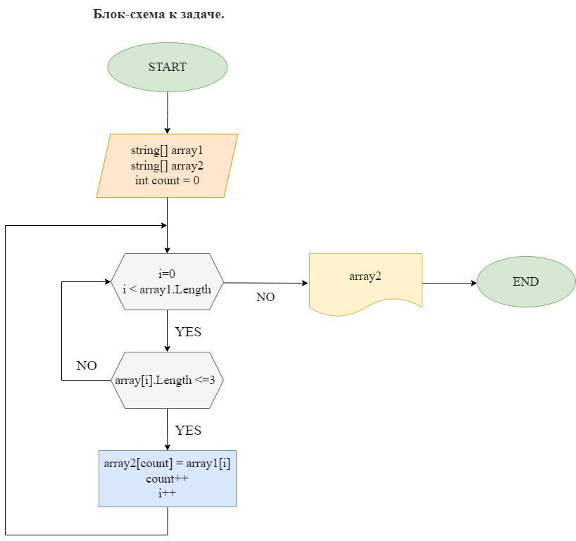

# Итоговая проверочная работа.
Данная работа необходима для проверки знаний и навыков по итогу прохождения первого блока обучения по программе разработчик.

## Для выполнения проверочной работы необходимо:

1. Создать репозиторий на GitHub.
2. Нарисовать блок-схему алгоритма.
3. Снабдить репозиторий оформленным текстовым описанием решения (readme.md)
4. Написать программу, решающую поставленную задачу.

## **Задача**: 
### Написать программу, которая из имеющегося массива строк формирует массив строк, длина которых меньше либо равна 3 символа. Первоначальный массив можно ввести с клавиатуры, либо задать на старте выполнения алгоритма.

## *Примеры*:
["hello", "2", "world", ":-"] -> ["2", ":-"]

["1234", "1567", "-2", "computer science"] -> ["-2 "]

["Russia", "Denmark", "Kazan"] -> [ ]

# *Блок-схема алгоритма:*

# *Алгоритм решения задачи:*
* ### Объявляем и инициализируем массив "array"с типом данных "string"
* ### Объявляем массив "newArray", задаем размер массива, равную первому newArray = new string[array.Length].
* ### Создаем метод с двумя аргументами "array" и  "newArray". Метод формирует из имеющегося массива строк новый массив из строк, длина которых меньше, либо равна 3 символам. Используя переменную count (равна 0) и цикл for(int i = 0; i < array1.Length; i++), наш метод проверяет условие if(array1[i].Length <= 3): если элемент масиива array с индексом [i], размера Length, меньше или равен 3 символам, тогда выполняется действие (операция присваивания) array2[count] = array1[i], где переменная count служит неким контейнером записи на каждой итерации цикла.
* ### Результатом работы метода является вывод значений элементов массива, состоящих из строк, длина которых меньше либо равна 3 символам.
* ### Выводим результат в консоль через метод void PrintArray().